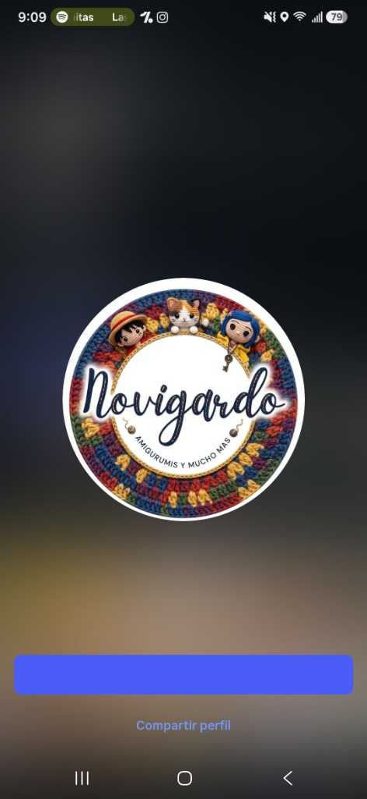

# 🧶 Novigardo - Amigurumis y Mucho Más

> Página web interactiva para personalizar muñecos tejidos (amigurumis) a mano.



## ✨ Descripción

**Novigardo** es una página web que permite a los clientes diseñar su propio muñeco tejido (amigurumi) paso a paso, eligiendo:
- 🐰 **Cabeza**: Conejito, Osito, Gatito, Perrito, Unicornio, Dinosaurio, Personaje Animado o Persona
- 📏 **Tamaño y color del cuerpo**: Pequeño (15cm), Mediano (25cm), Grande (35cm) + 10 colores de lana
- 👗 **Ropa**: Overol, Vestido, Suéter, Falda, Pantalón, Pijama, Capa o Sin ropa
- 🎀 **Accesorios** (selección múltiple): Moño, Collar, Lentes, Flores, Gorrito, Bufanda, Bolsito, Corona

El precio se actualiza en tiempo real según las opciones elegidas. Al finalizar, el cliente puede enviar su pedido directamente por Instagram DM a [@novigardo](https://instagram.com/novigardo).

## 🖥️ Demo

Abre el archivo `index.html` en tu navegador para ver la página.

## 📁 Estructura del Proyecto

```
novigardo-web/
├── index.html          # Página principal (728 líneas)
├── styles.css          # Estilos CSS responsive (1,158 líneas)
├── script.js           # Lógica JavaScript (564 líneas)
├── assets/
│   └── logo.jpg        # Logo de Novigardo
└── README.md           # Este archivo
```

## 🎨 Características

### Personalizador Interactivo
- **4 pasos** tipo wizard con barra de progreso
- **Vista previa SVG** del muñeco que se actualiza en tiempo real
- **Textura de crochet** sutil en el SVG para simular el tejido
- **Selector de colores** para cuerpo y ropa (paleta de colores de lana)
- **Precio dinámico** que se actualiza al seleccionar opciones
- **Selección múltiple** de accesorios

### Secciones de la Página
| Sección | Descripción |
|---------|-------------|
| 🏠 Hero | Logo animado + llamada a la acción |
| 🎨 Personalizador | Wizard de 4 pasos con vista previa SVG |
| 📸 Galería | Grid con filtros (Animales, Personajes, Profesiones) |
| 💝 Sobre Nosotros | Historia de la marca + características |
| ⭐ Testimonios | Carrusel automático de reseñas |
| 📱 Contacto | Info de contacto + enlace a Instagram |

### Diseño
- Paleta de colores cálidos (rosa, crema, beige)
- Fuentes: **Quicksand** (títulos) + **Nunito** (texto)
- Responsive: móvil, tablet y desktop
- Animaciones suaves al hacer scroll
- Navegación sticky con efecto blur
- Menú hamburguesa en móvil

## 💰 Precios (editables en script.js)

### Cabezas
| Tipo | Precio |
|------|--------|
| Conejito, Osito, Gatito, Perrito | $8 |
| Unicornio, Dinosaurio | $10 |
| Personaje Animado | $12 |
| Persona (profesión) | $15 |

### Tamaño del Cuerpo
| Tamaño | Precio |
|--------|--------|
| Pequeño (15cm) | $10 |
| Mediano (25cm) | $18 |
| Grande (35cm) | $28 |

### Ropa
| Prenda | Precio |
|--------|--------|
| Sin ropa | $0 |
| Suéter, Falda, Pantalón | $4 |
| Overol, Pijama | $5 |
| Vestido | $6 |
| Capa | $8 |

### Accesorios
| Accesorio | Precio |
|-----------|--------|
| Moño, Collar | $2 |
| Lentes, Flores | $3 |
| Gorrito, Bufanda, Bolsito | $4 |
| Corona | $5 |

## 🔧 Cómo Editar

### Cambiar precios
Edita el objeto `PRICES` en `script.js` (líneas 14-19):
```javascript
const PRICES = {
  heads: { bunny: 8, bear: 8, cat: 8, ... },
  sizes: { small: 10, medium: 18, large: 28 },
  clothing: { none: 0, overalls: 5, dress: 6, ... },
  accessories: { bow: 2, necklace: 2, glasses: 3, ... }
};
```

### Agregar fotos reales a la galería
En `index.html`, busca la sección `#galeria` y reemplaza los placeholders:
```html
<!-- Cambiar esto: -->
<div class="gallery-placeholder">🐰<span>Conejita Rosa</span></div>

<!-- Por esto: -->

```

### Cambiar colores de la página
Edita las variables CSS en `styles.css` (líneas 2-21):
```css
:root {
  --color-bg: #FFF8F0;        /* Fondo principal */
  --color-bg-alt: #F5E6E0;    /* Fondo secundario */
  --color-primary: #D4A0A0;   /* Rosa medio */
  --color-cta: #E8A0B4;       /* Botones principales */
  ...
}
```

### Cambiar la cuenta de Instagram
Busca `novigardo` en `script.js` y `index.html` y reemplaza con tu usuario.

## 🚀 Despliegue

La página es 100% estática (HTML + CSS + JS), se puede subir a:

### Netlify (recomendado, gratis)
1. Ve a [netlify.com](https://netlify.com)
2. Arrastra y suelta la carpeta `novigardo-web`
3. ¡Listo! Tendrás una URL pública

### GitHub Pages (gratis)
1. Sube este repositorio a GitHub
2. Ve a Settings > Pages
3. Selecciona la rama `main` y carpeta `/ (root)`
4. Tu página estará en `https://tu-usuario.github.io/novigardo-web/`

### Vercel (gratis)
1. Ve a [vercel.com](https://vercel.com)
2. Importa tu repositorio de GitHub
3. Deploy automático

## 📋 Pendientes / Ideas Futuras

- [ ] Agregar fotos reales de los amigurumis en las tarjetas de selección
- [ ] Agregar fotos reales en la galería
- [ ] Agregar fotos del proceso de tejido en "Sobre Nosotros"
- [ ] Considerar fotos superpuestas (con fondo transparente) para vista previa más realista
- [ ] Agregar más tipos de cabeza según demanda
- [ ] Integrar con sistema de pagos (opcional)
- [ ] Agregar sección de FAQs
- [ ] Agregar testimonios reales de clientes

## 🛠️ Tecnologías

- **HTML5** - Estructura semántica
- **CSS3** - Variables, Grid, Flexbox, animaciones
- **JavaScript** (vanilla) - Sin frameworks ni dependencias
- **SVG** - Vista previa interactiva del muñeco
- **Google Fonts** - Quicksand + Nunito

## 📄 Licencia

© 2026 Novigardo - Todos los derechos reservados.
Hecho con 💝 y mucho hilo.
